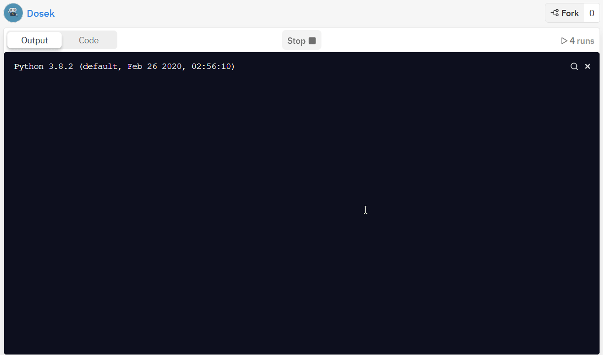

# passman
A simple password managing command-line interface that has no package dependencies (for now).
Install and run it locally without caring about requirements.

---

## How to use?
### Quick start
Run the project as a module by doing `python -m passman`.

### Additional features
To be familiar with flags add `--help` at the end, this displays you the useful information.

### Example
Let's do `python -m passman --setup`. This calls a particular method that does all the setting magic.

---

## Usage Examples
### Generating the password and showing the data

